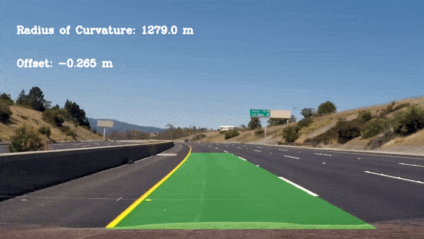

# Udacity Self-Driving Car Engineer Nanodegree

This repository houses my solutions for projects completed as part of Udacity's [Self-driving Car Engineer Nanodegree](https://www.udacity.com/course/self-driving-car-engineer-nanodegree--nd013).

## Projects

### Basic Lane Line Detection
Employ region of interest selection, grayscaling, Gaussian smoothing, Canny Edge Detection and Hough Transform line detection to identify lane lines on the road in an image.

  
_Simple linearly extrapolated lane detections_

[Source](https://github.com/davidxnhu/Self-Driving-Car-Engineer-Nanodegree/tree/main/P1%20LaneLines)

### Advanced Lane Line Detection
Find lane markings in images and video using color transformations, gradients, and perspective transformation. Determine the curvature of the lane and the vehicle position with respect to center.

  
_Lane detections with curvature and offset_

[Source](https://github.com/davidxnhu/Self-Driving-Car-Engineer-Nanodegree/tree/main/P2%20Advanced-Lane-Lines)

### Traffic sign classifier
Train and validate a deep learning model using TensorFlow to classify traffic sign images using the German Traffic Sign Dataset.

[Source](https://github.com/davidxnhu/Self-Driving-Car-Engineer-Nanodegree/tree/main/P3%20Traffic-Sign-Classifier)  

### Behavioral Cloning
Use Udacity's driving simulator to create a dataset to clone driving behavior by training and validating a model using Keras. The model outputs a steering angle to an autonomous vehicle.

  
_Autonomus driving in the simulator_  

[Source](https://github.com/davidxnhu/Self-Driving-Car-Engineer-Nanodegree/tree/main/P4%20Behavioral-Cloning)

### Extended Kalman Filter
Utilize a Kalman filter, and simulated lidar and radar measurements to track the a bicycle's position and velocity.  

Lidar measurements are red circles, radar measurements are blue circles with an arrow pointing in the direction of the observed angle, and estimation markers are green triangles.

  

[Source](https://github.com/davidxnhu/Self-Driving-Car-Engineer-Nanodegree/tree/main/P5%20Extended-Kalman-Filter)

### Localization: Particle Filter

A 2 dimensional particle filter in C++. The particle filter is given a map and some initial localization information (analogous to what a GPS would provide). At each time step the filter is also given observation and control data.

[Source](https://github.com/davidxnhu/Self-Driving-Car-Engineer-Nanodegree/tree/main/P6%20Kidnapped-Vehicle)

### Path Planning: Vehicle Trajectories

Safely navigate a self-driving car around a virtual highway with other traffic that is driving +-10 MPH of the 50 MPH speed limit. The car should try to go as close as possible to the 50 MPH speed limit, which means passing slower traffic when possible, note that other cars will try to change lanes too. The car should avoid hitting other cars at all cost as well as driving inside of the marked road lanes at all times, unless going from one lane to another. The car should be able to make one complete loop around the 6946m highway. Since the car is trying to go 50 MPH, it should take a little over 5 minutes to complete 1 loop. Also the car should not experience total acceleration over 10 m/s^2 and jerk that is greater than 10 m/s^3.

[Source](https://github.com/davidxnhu/Self-Driving-Car-Engineer-Nanodegree/tree/main/P7%20Path-Planning)

### PID controller

Use a Proportional-Integral-Derivative Controller (PID), to control the steering angle of a simuluated self-driving car maneuvering around a circular track.

[Source](https://github.com/davidxnhu/Self-Driving-Car-Engineer-Nanodegree/tree/main/P8%20PID%20controller)

### Capstone: Programming a real self-driving car

Write ROS nodes to implement core functionality of the autonomous vehicle system, including traffic light detection, control, and waypoint following. The following is a system architecture diagram showing the ROS nodes and topics used in the project.

[Source](https://github.com/davidxnhu/Self-Driving-Car-Engineer-Nanodegree/tree/main/P9%20Capstone-system-integration)
